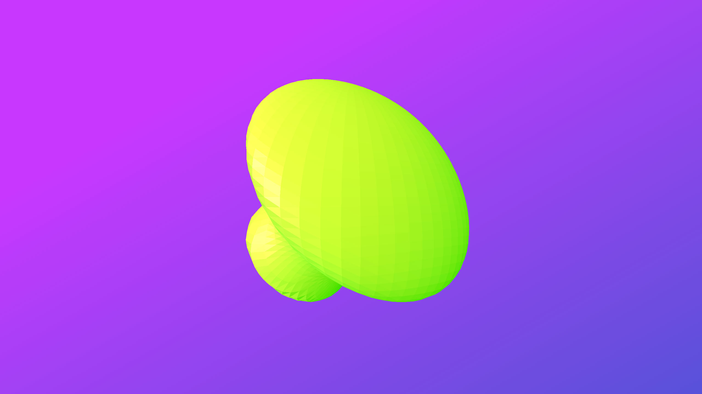

# Experiment 4

## The Spike Ball!
After some hacking of the Explode Modifier script, I've managed to add three new faces to each face in the Icosahedron Geometry. Connecting them to a vertex positioned in the center of that face and moving them individually enables me to achieve this effect.

Play around with the *size* and *speed* variables and see how it behaves.

[Live demo](http://danieldelcore.com/lab/4)

## Initial setup
- `npm install --global gulp-cli` : Install gulp globally
- `npm i` Install dependencies

## Building for development
- `gulp dev` : Build files will be output to the '.tmp' directory.

## Building for production
- `gulp build` : Build files will be output to the 'deploy' directory.

## Pushing a new release
- `gulp build` : Compile local changes
- `git add .` : Stage changes
- `git commit -m"change description"` : comment on your changes
- `git tag -a v1.0.0 -m "Change description"` : Add a new tagged release
- `git push --follow-tags` : Push staged changes and tags
